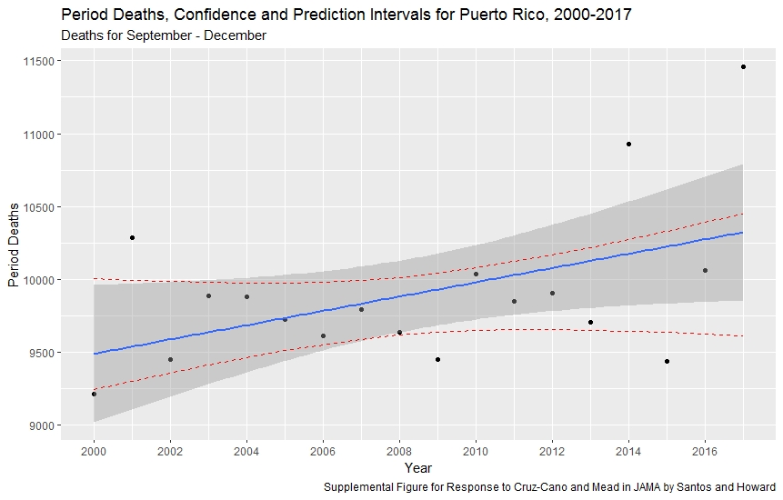
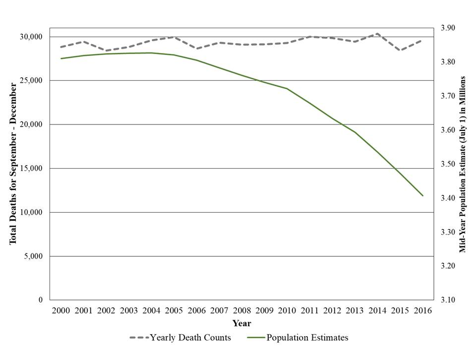
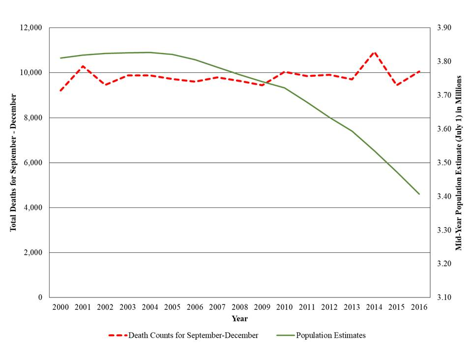

# Introduction 
This repository contains information and code that support our Letter in response to Cruz-Cano and Mead published in the Journal of the American Medical Association.

# Content
This reposity contains:

* [R code for calculating the Pearson Correlation Coefficient between total population, and total and period-specific deaths between 2000 and 2016, and 2010-2016](Code_Correlations_JAMA_Reply.R)

* [A comma separated value file (csv) that includes the following variables](Puerto_Rico_Deaths_00_17.csv):
    + **Year** - Year of the Observation 
    + **Pop_Est** - 2000-2016 Population Estimates for Puerto Rico produced by the U.S. Census Bureau 
    + **Total_Deaths** - 2000-2016 Total Deaths for Puerto Rico 
    + **Period_Deaths** - 2000-2016 Period Specific Deaths (September-December)  

# Data 

## Population Estimates
We accessed population estimates for Puerto Rico through [American Factfinder](https://factfinder.census.gov/faces/nav/jsf/pages/index.xhtml). 

## Death Counts
We contacted Jonathan Morales Gonzalez, M.S. (jonmorales@salud.pr.gov) on November 1, 2017 and requested the counts from the Puerto Rico Vital Statistics System for the 2010-2016 period. Mr. Morales Gonzáles is the Vital Statistics and Demographic Affairs Advisor for the Division of Statistical Analysis in the [Puerto Rico Department of Health](http://www.salud.gov.pr/). He provided historical counts for the 2010-2016 period, with the caveat that at that point the 2016 counts were preliminary, and the 2017 counts were being inputed into the system. Some deaths may have been also missing from 2015. Death counts for the 2000-2009 period were drawn from the Center for Diseases Control and Prevention records and validated with publicly shared data produced by the Puerto Rico Department of Health.  The latest public released of the data with official validation by the Government of Puerto Rico was shared in May 31, 2018 which included the deaths registered in the administrative database up until May 31, 2018. Our data includes the updated counts for the 2013-2017 period included in this release of the data. 

With that preliminary dataset we produced early estimates, which were shared as part of our pre-print titled [Estimates of excess deaths in Puerto Rico following Hurricane Maria (November, 2017)](https://osf.io/preprints/socarxiv/s7dmu/). The pre-print also contains information regarding the state of data in Puerto Rico back in November 2017 and **our data management** and **procedures** used to reach the early estimates of approximately **1,085 deaths** by the end of October 2017. 

This is how we built the dataset used for our analysis.

# Regression Approach to Predicting Deaths using 2000-2017 data
Figure 1, below, was produced using data from 2000-2017. I specified an OLS model controlling for year and Hurricane Maria (dummy for 2017). 

* The results shown below include: 
    + Observations - black dots
    + Predicted value - blue line
    + Confidence Intervals of the Predicted Value - Grey 
    + Prediction Intervals for the Observation - dashed red lines

When we calculate the difference between the number of deaths for our period of interest and the upper level of the 95% C.I. the result is **1,011 excess deaths**. The differences found here could come from use of updated counts for the 2013-2017 years as released in May 31, 2018 by the Government of Puerto Rico. Nevertheless, the number falls withing the interval presented in our previous Research Letter. **(1,139, 95% C.I.=1,006;1,272)** and within the interval of the census-based model discussed in our Reply. 

We are sharing our [code file](OLS_Figure_Repository.R).

* This will guide you thtough the process of: 
         + Importing the data
         + Fitting an basic OLS model using the lm function. We ran many models, and our results are robust to other specifications. 
         + Producing the "synthetic" data to solve the equation produced with lm (new_year object).
         + Solving the OLS formula without Hurricane Maria effects.
         + Producing "prediction intervals" for the observations. 
         + Merging everything in one dataset with *cbind*. 
         + Produce the [figure](RPlot10.jpeg) shown above.

If you have any questions, please create an [issue](https://github.com/alexisrsantos/JAMA_Reply/issues)

# Visualization of Total Population and Death Counts
## Population Estimates and Total Deaths
In this first figure, we present the pattern of population estimates and total deaths for Puerto Rico 2000-2016.

## Population Estimates and Period Specific Deaths (September-December)
In this second figure, we present the pattern of population estimates and period specific deaths for Puerto Rico 2000-2016

These figures were produced using Excel. 

# Problems?
If you find any problems with our data or code, please create an [issue](https://github.com/alexisrsantos/JAMA_Reply/issues) and we will answer it as soon as possible. 

# Metadata
This repository is maintained by [Dr. Alexis R. Santos](https://scholar.google.com/citations?user=oPZ-RDgAAAAJ&hl=en) and reviewed by [Dr. Jeffrey T. Howard](https://scholar.google.com/citations?user=l0A2z2YAAAAJ&hl=en).
